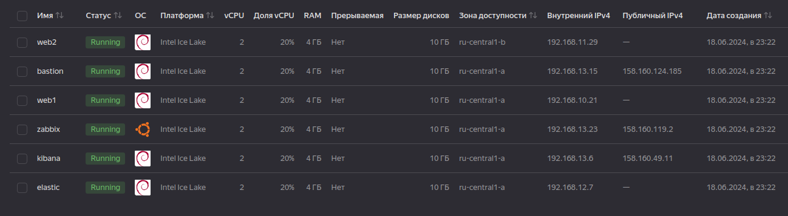
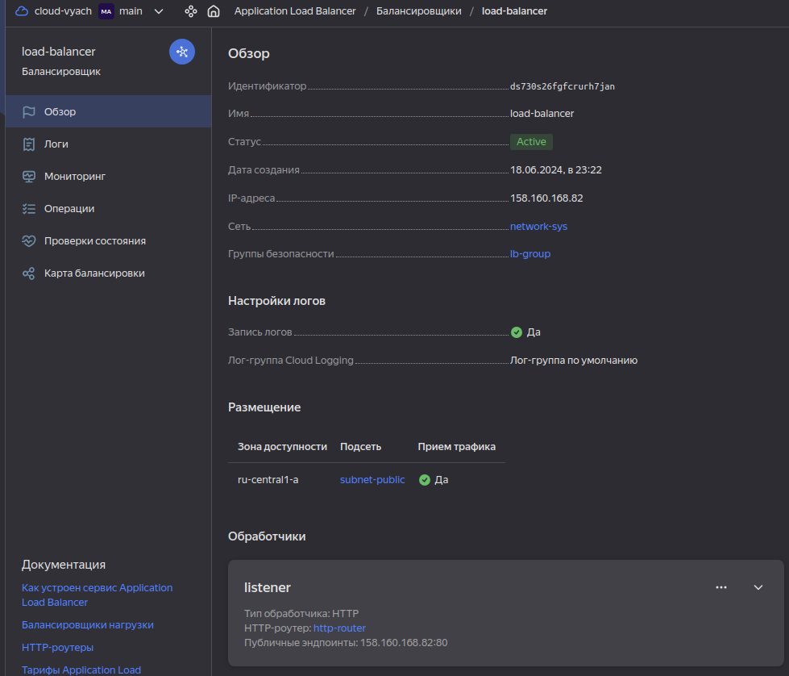

#  Дипломная работа по профессии «Системный администратор» SYS-27 Вячеслав Шорохов

Содержание
==========
* [Задача](#Задача)
* [Инфраструктура](#Инфраструктура)
    * [Сайт](#Сайт)
    * [Мониторинг](#Мониторинг)
    * [Логи](#Логи)
    * [Сеть](#Сеть)
    * [Резервное копирование](#Резервное-копирование)
    * [Дополнительно](#Дополнительно)
* [Выполнение работы](#Выполнение-работы)
* [Критерии сдачи](#Критерии-сдачи)
* [Как правильно задавать вопросы дипломному руководителю](#Как-правильно-задавать-вопросы-дипломному-руководителю) 

---------

## Задача
Ключевая задача — разработать отказоустойчивую инфраструктуру для сайта, включающую мониторинг, сбор логов и резервное копирование основных данных. Инфраструктура должна размещаться в [Yandex Cloud](https://cloud.yandex.com/) и отвечать минимальным стандартам безопасности: запрещается выкладывать токен от облака в git. Используйте [инструкцию](https://cloud.yandex.ru/docs/tutorials/infrastructure-management/terraform-quickstart#get-credentials).

**Перед началом работы над дипломным заданием изучите [Инструкция по экономии облачных ресурсов](https://github.com/netology-code/devops-materials/blob/master/cloudwork.MD).**

## Инфраструктура
Для развёртки инфраструктуры используйте Terraform и Ansible.  

Не используйте для ansible inventory ip-адреса! Вместо этого используйте fqdn имена виртуальных машин в зоне ".ru-central1.internal". Пример: example.ru-central1.internal  

Важно: используйте по-возможности **минимальные конфигурации ВМ**:2 ядра 20% Intel ice lake, 2-4Гб памяти, 10hdd, прерываемая. 

**Так как прерываемая ВМ проработает не больше 24ч, перед сдачей работы на проверку дипломному руководителю сделайте ваши ВМ постоянно работающими.**

Ознакомьтесь со всеми пунктами из этой секции, не беритесь сразу выполнять задание, не дочитав до конца. Пункты взаимосвязаны и могут влиять друг на друга.

### Сайт
Создайте две ВМ в разных зонах, установите на них сервер nginx, если его там нет. ОС и содержимое ВМ должно быть идентичным, это будут наши веб-сервера.

Используйте набор статичных файлов для сайта. Можно переиспользовать сайт из домашнего задания.

Виртуальные машины не должны обладать внешним Ip-адресом, те находится во внутренней сети. Доступ к ВМ по ssh через бастион-сервер. Доступ к web-порту ВМ через балансировщик yandex cloud.

Настройка балансировщика:

1. Создайте [Target Group](https://cloud.yandex.com/docs/application-load-balancer/concepts/target-group), включите в неё две созданных ВМ.

2. Создайте [Backend Group](https://cloud.yandex.com/docs/application-load-balancer/concepts/backend-group), настройте backends на target group, ранее созданную. Настройте healthcheck на корень (/) и порт 80, протокол HTTP.

3. Создайте [HTTP router](https://cloud.yandex.com/docs/application-load-balancer/concepts/http-router). Путь укажите — /, backend group — созданную ранее.

4. Создайте [Application load balancer](https://cloud.yandex.com/en/docs/application-load-balancer/) для распределения трафика на веб-сервера, созданные ранее. Укажите HTTP router, созданный ранее, задайте listener тип auto, порт 80.

Протестируйте сайт
`curl -v <публичный IP балансера>:80` 

### Мониторинг
Создайте ВМ, разверните на ней Zabbix. На каждую ВМ установите Zabbix Agent, настройте агенты на отправление метрик в Zabbix. 

Настройте дешборды с отображением метрик, минимальный набор — по принципу USE (Utilization, Saturation, Errors) для CPU, RAM, диски, сеть, http запросов к веб-серверам. Добавьте необходимые tresholds на соответствующие графики.

### Логи
Cоздайте ВМ, разверните на ней Elasticsearch. Установите filebeat в ВМ к веб-серверам, настройте на отправку access.log, error.log nginx в Elasticsearch.

Создайте ВМ, разверните на ней Kibana, сконфигурируйте соединение с Elasticsearch.

### Сеть
Разверните один VPC. Сервера web, Elasticsearch поместите в приватные подсети. Сервера Zabbix, Kibana, application load balancer определите в публичную подсеть.

Настройте [Security Groups](https://cloud.yandex.com/docs/vpc/concepts/security-groups) соответствующих сервисов на входящий трафик только к нужным портам.

Настройте ВМ с публичным адресом, в которой будет открыт только один порт — ssh.  Эта вм будет реализовывать концепцию  [bastion host]( https://cloud.yandex.ru/docs/tutorials/routing/bastion) . Синоним "bastion host" - "Jump host". Подключение  ansible к серверам web и Elasticsearch через данный bastion host можно сделать с помощью  [ProxyCommand](https://docs.ansible.com/ansible/latest/network/user_guide/network_debug_troubleshooting.html#network-delegate-to-vs-proxycommand) . Допускается установка и запуск ansible непосредственно на bastion host.(Этот вариант легче в настройке)

### Резервное копирование
Создайте snapshot дисков всех ВМ. Ограничьте время жизни snaphot в неделю. Сами snaphot настройте на ежедневное копирование.

### Дополнительно
Не входит в минимальные требования. 

1. Для Zabbix можно реализовать разделение компонент - frontend, server, database. Frontend отдельной ВМ поместите в публичную подсеть, назначте публичный IP. Server поместите в приватную подсеть, настройте security group на разрешение трафика между frontend и server. Для Database используйте [Yandex Managed Service for PostgreSQL](https://cloud.yandex.com/en-ru/services/managed-postgresql). Разверните кластер из двух нод с автоматическим failover.
2. Вместо конкретных ВМ, которые входят в target group, можно создать [Instance Group](https://cloud.yandex.com/en/docs/compute/concepts/instance-groups/), для которой настройте следующие правила автоматического горизонтального масштабирования: минимальное количество ВМ на зону — 1, максимальный размер группы — 3.
3. В Elasticsearch добавьте мониторинг логов самого себя, Kibana, Zabbix, через filebeat. Можно использовать logstash тоже.
4. Воспользуйтесь Yandex Certificate Manager, выпустите сертификат для сайта, если есть доменное имя. Перенастройте работу балансера на HTTPS, при этом нацелен он будет на HTTP веб-серверов.

## Выполнение работы
На этом этапе вы непосредственно выполняете работу. При этом вы можете консультироваться с руководителем по поводу вопросов, требующих уточнения.

⚠️ В случае недоступности ресурсов Elastic для скачивания рекомендуется разворачивать сервисы с помощью docker контейнеров, основанных на официальных образах.

**Важно**: Ещё можно задавать вопросы по поводу того, как реализовать ту или иную функциональность. И руководитель определяет, правильно вы её реализовали или нет. Любые вопросы, которые не освещены в этом документе, стоит уточнять у руководителя. Если его требования и указания расходятся с указанными в этом документе, то приоритетны требования и указания руководителя.

## Критерии сдачи
1. Инфраструктура отвечает минимальным требованиям, описанным в [Задаче](#Задача).
2. Предоставлен доступ ко всем ресурсам, у которых предполагается веб-страница (сайт, Kibana, Zabbix).
3. Для ресурсов, к которым предоставить доступ проблематично, предоставлены скриншоты, команды, stdout, stderr, подтверждающие работу ресурса.
4. Работа оформлена в отдельном репозитории в GitHub или в [Google Docs](https://docs.google.com/), разрешён доступ по ссылке. 
5. Код размещён в репозитории в GitHub.
6. Работа оформлена так, чтобы были понятны ваши решения и компромиссы. 
7. Если использованы дополнительные репозитории, доступ к ним открыт. 

## Как правильно задавать вопросы дипломному руководителю
Что поможет решить большинство частых проблем:
1. Попробовать найти ответ сначала самостоятельно в интернете или в материалах курса и только после этого спрашивать у дипломного руководителя. Навык поиска ответов пригодится вам в профессиональной деятельности.
2. Если вопросов больше одного, присылайте их в виде нумерованного списка. Так дипломному руководителю будет проще отвечать на каждый из них.
3. При необходимости прикрепите к вопросу скриншоты и стрелочкой покажите, где не получается. Программу для этого можно скачать [здесь](https://app.prntscr.com/ru/).

Что может стать источником проблем:
1. Вопросы вида «Ничего не работает. Не запускается. Всё сломалось». Дипломный руководитель не сможет ответить на такой вопрос без дополнительных уточнений. Цените своё время и время других.
2. Откладывание выполнения дипломной работы на последний момент.
3. Ожидание моментального ответа на свой вопрос. Дипломные руководители — работающие инженеры, которые занимаются, кроме преподавания, своими проектами. Их время ограничено, поэтому постарайтесь задавать правильные вопросы, чтобы получать быстрые ответы :)

#  Решение.

## Инфраструктура

Для развёртки инфраструктуры были использованы Terraform и Ansible.

Чтобы использовались fqdn имена в файле hosts ansible согласно задания, в файле terraform: `outputs.tf` был прописан вывод в файл hosts fqdn имен.

Для виртуальных машин была использована рекомендованная конфигурация. ОС виртуальных машин была выбрана Debian 11, как более легкая и стабильная, для zabbix сервера была выбрана ОС Ubuntu 22, для упрощения установки на него mysql.

Были созданы виртуальные машины: два веб сервера, zabbix сервер, kibana сервер, elasticsearch сервер, bastion сервер. Также была настроена сеть согласно задания.

Файлы terraform:
`main.tf` - Развертывание виртуальных машин
`network.tf` - Создание и настройка сети, подсетей, балансировщика, групп безопасности.

`Созданные в yc виртуальные машины:`

### Сайт

В качестве сайта была использована модифицированная стартовая страница nginx, туда были добавлены строки, использующие информацию ansible gather_facts и картинка с моим аватаром.

Роль ansible: `web`

`Стартовая страница сайта:`

1. Была создана target group и в нее включены созданные виртуальные машины с web серверами.
`target group:`

2. Была создана backend group и настроена на созданную ранее target group.
`backend group:`

3. Был создан http router и указан путь  /, на backend group — созданную ранее.
`http router:`

4. Был создан application load balancer для распределения трафика на веб-сервера. Указан http router, созданный ранее, задан listener тип auto, порт 80.
`application load balancer:`

Корректная работа сайта и балансировщика была протестирована командой: `curl -v <публичный IP балансера>:80` На скриншотах видно что сайт отвечает на запрос разными внутренними адресами веб серверов.
`curl 1:`

`curl 2:`

Сайт доступен для проверки по ссылке: [http://158.160.176.119:80/](http://158.160.176.119/)

### Мониторинг

На отдельной виртуальной машине был развернут zabbix сервер.
Роль ansible: `zabbix_server`

На каждую виртуальную машину был установлен zabbix агент и настроен на отправление метрик в zabbix сервер.
Роль ansible: `zabbix_agent`

Скриншот веб интерфейса zabbix, в списке хостов все созданные виртуальные машины:
`zabbix:`

Настройте дешборды с отображением метрик.
Скриншот дешборда zabbix:
`zabbix:`

Сервер zabbix доступен по ссылке:  http://51.250.89.172:8080/zabbix.php?action=dashboard.view

### Логи

На отдельной виртуальной машине был развернут elasticsearch сервер.
Роль ansible: `elastic`

На web сервера был установлен filebeat и настроен  для сбора логов access.log, error.log  nginx  и их отправки на elasticsearch сервер.
Роль ansible: `filebeat`

На отдельной виртуальной машине был развернут kibana сервер и настроен на работу с сервером elasticsearch.
Роль ansible: `kibana`

Скриншот веб интерфейса kibana, на котором видна активность логирования:
`kibana:`

Скриншот веб интерфейса kibana, на котором видно хосты для kibana:
`kibana:`

Скриншот веб интерфейса kibana, на котором видно поток логирования:
`kibana:`

Сервер kibana доступен по ссылке: http://158.160.127.76:5601/app/home#/

### Сеть

Файлы terraform:
`network.tf` - Создание и настройка сети, подсетей, балансировщика, групп безопасности.

Был развернут один VPC: `network-sys`. Сервера web, Elasticsearch помещены в приватные подсети. Сервера Zabbix, Kibana, application load balancer определены в публичную подсеть.

`Схема сети:`

`Подсети:`

Настроены security groups соответствующих сервисов на входящий трафик только к нужным портам.

`Группы безопасности:`

Настроена ВМ с публичным адресом, в которой открыт только один порт — ssh. Эта вм реализует концепцию bastion host. 

Запись в файле `hosts` для ansible, позволяющая подключаться к виртуальным машинам через bastion сервер:
`ansible_ssh_common_args='-o StrictHostKeyChecking=no -o UserKnownHostsFile=/dev/null -o ProxyCommand="ssh -o StrictHostKeyChecking=no -p 22 -W %h:%p -q vyach@${yandex_compute_instance.bastion.network_interface.0.nat_ip_address}"'`

Группа безопасности в yc для bastion хоста:
`bastion host:`

### Резервное копирование

Созданы snapshot дисков всех ВМ. Ограничение времени жизни snaphot неделя. Снимки дисков настроены на ежедневное копирование.

Файл terraform:
`snapshot.tf` - создание снимков дисков виртуальных машин по расписанию

Скриншот веб интерфейса yc, на котором видно расписание снимков ВМ:
`snapshot:`

